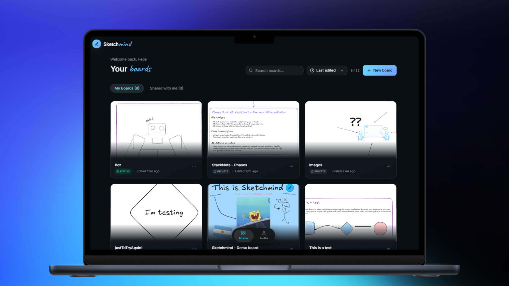
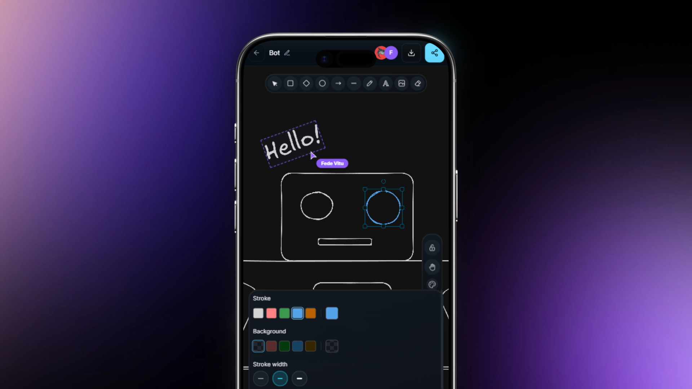
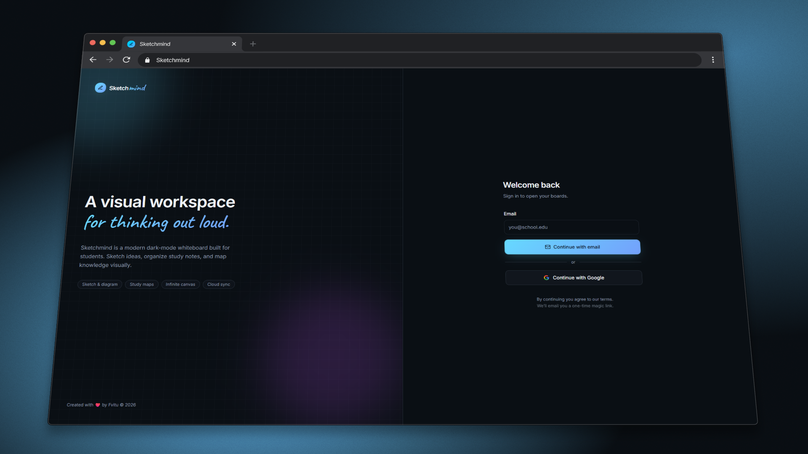

# Sketchmind

A dark-mode collaborative whiteboard built for students.

## Screenshots





## What is this

Sketchmind is a browser-based infinite canvas where you can sketch ideas, map out concepts, and study visually. It's aimed at students who want something more structured than a blank Excalidraw tab but less bloated than Notion or Miro. The whole thing is dark by default, with a Caveat font for text elements that gives it a handwritten, notebook feel.

What separates it from just running Excalidraw locally is the layer on top: boards are saved to a database, every change syncs to collaborators in real time, and you can invite others to a board via a share link. Images you drop onto the canvas get uploaded to Supabase Storage automatically, so they survive across sessions and show up for everyone in the room.

The real-time sync is handled by Liveblocks using Excalidraw's storage model. When you draw, your elements broadcast instantly to everyone in the room. The canvas state also writes to Supabase on a 2-second debounce via a `merge_canvas_patch` PostgreSQL RPC that does the read-merge-write in a single round-trip, which cuts save latency a lot when the database region is remote.

## Features

**Canvas**
- Full Excalidraw canvas in permanent dark mode
- Default font set to Caveat (font family 2) for a handwritten feel — applied on load and enforced on existing elements
- Custom background color picker (hex/RGB/alpha) with swatches, available on desktop and mobile
- Grid toggle via injected button in the Excalidraw toolbar
- Custom right-click context menu with Lucide icons and grouped separators
- Canvas handles recolored to match the app's cyan accent instead of Excalidraw's purple
- Drag-and-drop `.excalidraw` file restore onto a blank canvas
- Export to PNG with embedded scene JSON (drag the exported PNG back onto a blank canvas to restore)
- Image upload with 8MB per-image limit; images are uploaded to Supabase Storage and replaced in the scene with remote URLs so they stay small in the Liveblocks storage layer
- Hint viewer text intercepted and rendered in a custom overlay

**Collaboration**
- Real-time canvas sync via Liveblocks storage (elements + files broadcast on every local change)
- Live cursors with per-user colors, rendered in scene coordinates so they track correctly regardless of zoom and pan
- Real-time selection overlays — you can see what elements each collaborator has selected, rendered as a bounding box with their color
- Presence avatars in the board header showing who's in the room
- Capacity check: a warning banner appears at 10/10 collaborators
- Cursor updates throttled to 25/second (40ms) to avoid flooding Liveblocks
- Echo-loop prevention: remote updates don't get re-broadcast back to the room
- Images uploaded by one user sync to all collaborators in real time via `excalidrawFiles` Liveblocks storage

**Sharing**
- Board owners can generate a shareable link (unique token stored in `boards.share_token`)
- Anyone with the link hits `/join/:token`, gets added as `board_members` with role `editor`
- Owners can revoke sharing (unshare) from the board header
- Share button only visible to board owners; non-owners get a 403 on the API if they try
- Viewer role is modeled in the schema but currently all collaborators join as `editor`

**Dashboard**
- My Boards / Shared with Me tabs
- Sort by last edited, date created, or name — preference persisted in localStorage
- Live search / filter
- Board count shown against the per-user limit
- Create, rename, duplicate, and delete boards
- Collaborators can "leave" a shared board from their dashboard
- Animated skeleton loading state

**Auth**
- Magic link (email) sign-in via Resend — tokens stored and invalidated server-side in a `magic_links` table
- Google OAuth via popup flow using `google-auth-library`; the code exchange happens server-side
- Session stored in an httpOnly cookie managed by the Express server
- `display_name` is set only on first account creation, not overwritten on subsequent logins
- `RuntimeAuthConfig` fetched at boot so the login page shows only available auth methods

**Profile**
- Update display name
- Upload, update, and remove profile picture — stored in a public Supabase Storage `avatars` bucket
- Sign out

**PWA**
- Installable on Android and desktop via `vite-plugin-pwa` + Workbox service worker
- App shell precached; API and board routes never cached (network-only)
- Supabase Storage assets (avatars, thumbnails) served stale-while-revalidate
- Google Fonts cached indefinitely (cache-first)
- Offline page at `/offline`

**Auto-save**
- Canvas changes debounced 2 seconds then sent to the server
- Server calls `merge_canvas_patch` Postgres RPC — merges elements, appState, and files in one DB call
- Save status indicator in the board header (saved / saving / unsaved changes)

## Tech stack

```
Frontend
  - React 18 + TypeScript
  - Vite 5 (SWC) + React Router v6
  - Tailwind CSS 3
  - Excalidraw 0.18 (canvas engine)
  - Liveblocks 3 (@liveblocks/client, @liveblocks/react)
  - Framer Motion 12 (page transitions, animations)
  - Radix UI (headless component primitives)
  - shadcn/ui component layer (built on Radix)
  - TanStack React Query 5
  - react-colorful (background color picker)
  - Lucide React (icons)
  - Sonner (toasts)
  - Vercel Analytics

Backend / API
  - Express server (server.mjs) — handles all /api/* routes
  - Supabase JS client (@supabase/supabase-js 2)
  - Supabase PostgreSQL (boards, profiles, board_members, assets, magic_links)
  - Supabase Storage (avatars bucket, board assets)
  - Resend (transactional email for magic links)
  - google-auth-library (Google OAuth token verification)

Real-time
  - Liveblocks (presence, storage, cursors, room auth)

PWA
  - vite-plugin-pwa + Workbox

Deployment
  - Vercel (static build from /dist + serverless function for /api/*)
  - vercel.json routes /api/* to a single catch-all .mjs handler
```

## Getting started

### Prerequisites

- Node.js 18+ (no `engines` field in package.json, but Vite 5 and the server require it)
- A [Supabase](https://supabase.com) project with auth disabled at the platform level (auth is handled manually by the server)
- A [Liveblocks](https://liveblocks.io) account and secret key
- A [Resend](https://resend.com) account for magic link emails (optional if you're only using Google)
- A Google OAuth 2.0 client ID and secret (optional if you're only using magic links)

### Installation

```bash
git clone <repo-url>
cd sketchmind
npm install
cp .env.example .env.local
# fill in your env vars — see the table below
npm run dev
```

The dev server runs at `http://localhost:8080`. Both the Vite frontend and the Express API server start together via `node server.mjs`.

### Environment variables

| Variable | Purpose | Required | Example |
|---|---|---|---|
| `NEXT_PUBLIC_SUPABASE_URL` | Supabase project URL (client-side) | Yes | `https://xxxx.supabase.co` |
| `NEXT_PUBLIC_SUPABASE_ANON_KEY` | Supabase anon key (client-side) | Yes | `eyJh...` |
| `SUPABASE_URL` | Supabase project URL (server-side) | Yes | `https://xxxx.supabase.co` |
| `SUPABASE_SERVICE_ROLE_KEY` | Supabase service role key (server-side, never expose to browser) | Yes | `eyJh...` |
| `NEXT_PUBLIC_SITE_URL` | Public URL of the app | Yes | `http://localhost:8080` |
| `NEXTAUTH_SECRET` | Secret for signing session cookies | Yes | any long random string |
| `NEXTAUTH_URL` | Same as `NEXT_PUBLIC_SITE_URL` | Yes | `http://localhost:8080` |
| `AUTH_SECRET` | Alias used in some auth helpers | Yes | same as `NEXTAUTH_SECRET` |
| `AUTH_URL` | Alias used in some auth helpers | Yes | same as `NEXTAUTH_URL` |
| `RESEND_API_KEY` | Resend API key for magic link emails | No* | `re_xxx` |
| `RESEND_FROM` | From address for magic link emails | No* | `Sketchmind <noreply@yourdomain.com>` |
| `GOOGLE_CLIENT_ID` | Google OAuth client ID | No* | `xxxx.apps.googleusercontent.com` |
| `GOOGLE_CLIENT_SECRET` | Google OAuth client secret | No* | `GOCSPX-...` |

\* At least one of Resend or Google must be configured, otherwise the login page will show "Auth configuration incomplete."

The `LIVEBLOCKS_SECRET_KEY` is not in `.env.example` yet — you'll need to add it manually. The server uses it to sign Liveblocks auth tokens for each room. Without it, real-time collaboration won't work.

```
# Add this to your .env.local:
LIVEBLOCKS_SECRET_KEY=sk_...
```

## Database schema

Seven migrations, applied in order:

**`profiles`** — one row per user. Stores `id` (matches Supabase auth UID), `email`, `display_name`, `avatar_url`, and `board_limit` (defaults to 12, enforced server-side on create).

**`boards`** — the main entity. Stores `owner_id`, `title`, `description`, `visibility` (`private` or `shared`), `thumbnail_path`, `canvas_state` (JSONB with `elements`, `appState`, `files`), and `share_token` (unique, set when the owner enables sharing).

**`board_members`** — join table for shared boards. Columns: `board_id`, `user_id`, `role` (`editor` or `viewer`), `joined_at`, `is_shared_with_me`. Board owners are not in this table — ownership is tracked on the `boards` row.

**`assets`** — tracks files uploaded to Supabase Storage per board. `storage_path`, `public_url`, `mime_type`, `size_bytes`. Currently written but not heavily used in the UI beyond the upload pipeline.

**`magic_links`** — server-side one-time tokens for email auth. `token_hash`, `expires_at`, `used`. No public RLS policies — only the service role can access it.

**`merge_canvas_patch`** (RPC function) — merges a partial canvas patch into `boards.canvas_state` in a single round-trip. Checks ownership/membership before writing. Revoked from public and authenticated roles — only the service role (server) can call it.

Full `CREATE TABLE` statements are in `supabase/migrations/`.

## Limits

**12 boards per user.** Enforced server-side on the `POST /api/boards` handler. The limit comes from `profiles.board_limit`, which defaults to 12 in the schema (column has a `check (board_limit > 0)` constraint). The dashboard reads this value and shows a warning when you hit the cap.

**10 simultaneous collaborators per board.** Enforced at the UI layer via Liveblocks presence. In `CollaborativeCanvas.tsx`, `others.length >= 9` triggers a "Room is full (10/10 collaborators)" banner (others = 9 + self = 10). There's no hard server-side enforcement via Liveblocks room limits — the cap is a UI check only.

## AI statement

I used it for specific parts of the project: generating the initial Supabase schema as a starting point, the Liveblocks room auth endpoint boilerplate, and looking up Excalidraw API patterns I wasn't familiar with yet. The real-time sync logic, RLS policies, the canvas serialization/load cycle, the invitation system, and anything touching auth or database writes were all written by me. Those are areas where I prefer to maintain full understanding of what the code is doing.

## License

Licensed under the [MIT License](LICENSE).
